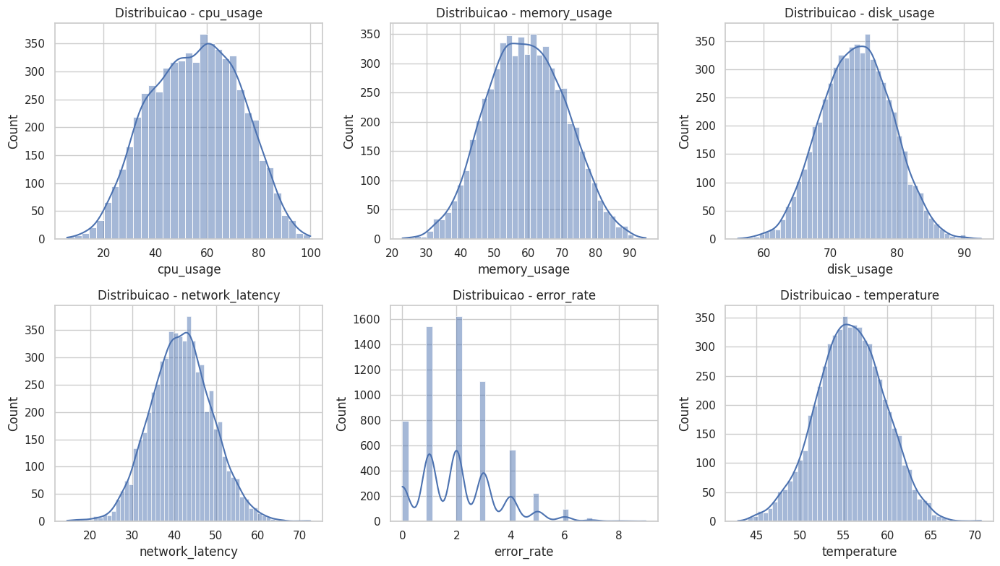
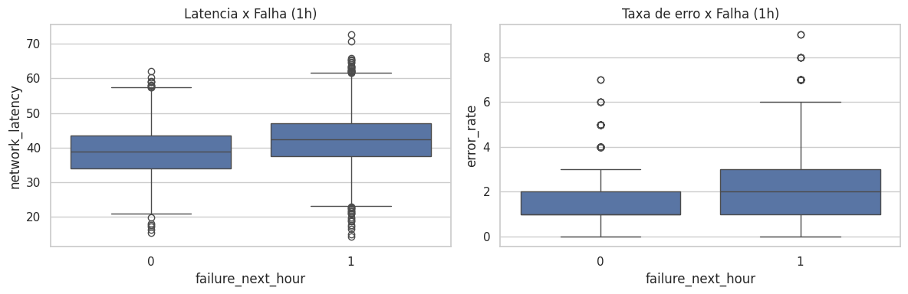
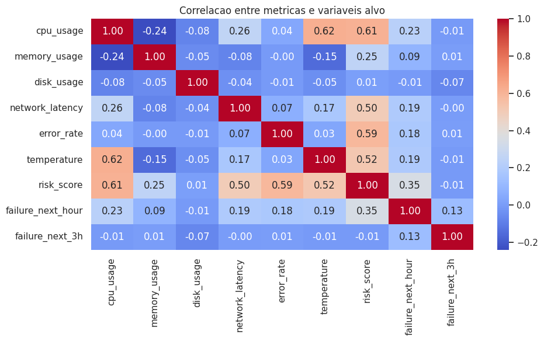
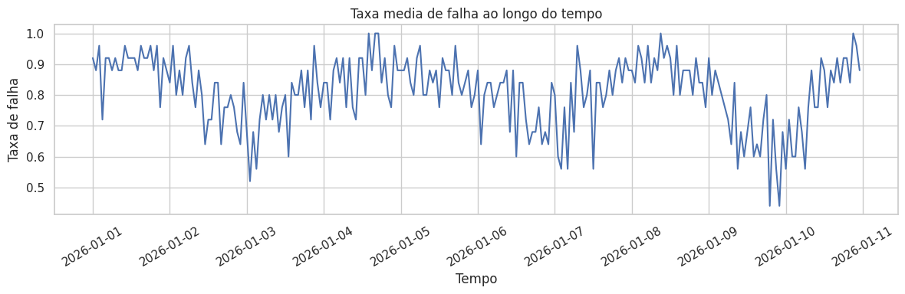
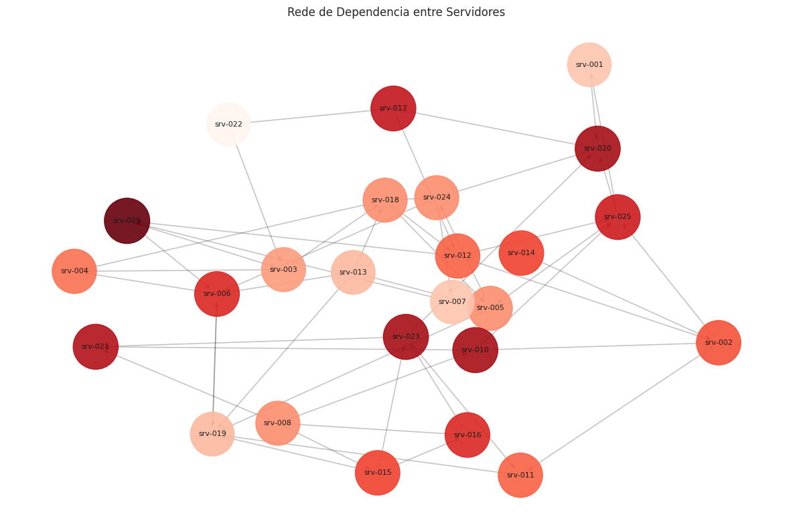

# Relatório Executivo - PredictIT

## Resumo Executivo

O PredictIT foi desenvolvido para estimar a probabilidade de falha de servidores nas próximas 1 a 3 horas a partir de métricas operacionais. O trabalho foi estruturado em um único notebook analítico, cobrindo simulação de dados, preparação, análise exploratória, modelagem preditiva e análise de rede.

O resultado central do projeto mostra que a previsão de falhas de curto prazo é viável com modelos de machine learning supervisionado, e que a combinação entre risco previsto e centralidade na infraestrutura amplia o valor operacional da análise.

## Contexto de Negócio

Falhas inesperadas em infraestrutura de TI geram indisponibilidade, impacto financeiro e resposta reativa da equipe técnica. A proposta do PredictIT é criar um mecanismo de antecipação de risco, permitindo ação preventiva antes da indisponibilidade.

## Base Analítica

O dataset simulado contempla:

- 6000 registros;
- 25 servidores;
- 240 observações temporais por servidor;
- Variáveis de uso de CPU, memória, disco, latência, erro e temperatura;
- Dois alvos binários: `failure_next_hour` e `failure_next_3h`.

## Principais Achados da Análise Exploratória

Os gráficos e tabelas do notebook apontam três sinais principais:

- `network_latency`, `error_rate` e `temperature` aumentam nos cenários associados à falha;
- A segmentação por `server_id` evidencia servidores mais propensos a comportamento crítico;
- A evolução temporal da taxa de falha reforça a utilidade de monitoramento contínuo.

Em termos executivos, isso indica que existe sinal operacional suficiente para classificar risco de forma antecipada e apoiar a priorização.

### Distribuição das Métricas Operacionais

As distribuições mostram comportamento consistente das variáveis simuladas, com dispersão suficiente para distinguir cenários normais e cenários mais próximos de falha.

### Variáveis Mais Associadas à Falha

Os boxplots reforçam que latência de rede e taxa de erro se elevam nos registros associados à falha na próxima hora, tornando-se variáveis operacionais particularmente relevantes para monitoramento preventivo.

### Correlação Entre Métricas e Variáveis-Alvo

O heatmap mostra que as variáveis operacionais apresentam associação útil com os alvos de falha, sustentando a aplicação de modelos supervisionados para previsão de curto prazo.

### Evolução Temporal da Taxa de Falha

A série temporal reforça a importância de acompanhamento contínuo, já que a taxa média de falha varia ao longo do tempo e pode servir como insumo para priorização operacional.

## Resultados de Modelagem

O notebook compara diferentes abordagens:

- Regressão Linear para tendência de risco;
- Regressão Logística como baseline de classificação;
- MLP e Deep Learning para capturar relações não lineares.

De acordo com a conclusão do próprio notebook, os resultados apresentaram desempenho consistente, com destaque para modelos como Regressão Logística, MLP e Deep Learning na tarefa de previsão de falhas de curto prazo.

Em termos executivos, isso sugere que o problema possui sinal suficiente para suportar um pipeline preditivo aplicável em contexto real de observabilidade.

## Análise de Rede e Criticidade

O projeto modela dependências entre servidores por meio de um grafo e aplica PageRank para identificar elementos mais centrais da infraestrutura.

### Grafo de Dependência e Criticidade

O ganho gerencial dessa etapa é direto:

- Não basta saber qual servidor tem maior risco individual de falha;
- Também é necessário identificar quais ativos são mais centrais e, portanto, podem gerar maior impacto sistêmico.

Ao combinar probabilidade de falha com centralidade, o projeto cria uma lógica de priorização mais aderente à operação real.

## Implicações Para a Operação

O PredictIT pode apoiar uma estratégia de TI mais proativa:

- Ranqueamento de servidores por risco;
- Alertas preventivos antes da falha;
- Priorização de ativos com maior impacto potencial;
- Redução do tempo de indisponibilidade e de incidentes críticos.

## Conclusão

O projeto demonstra que é possível prever falhas de curto prazo com base em métricas operacionais e enriquecer essa previsão com uma camada de inteligência estrutural via Network Science.

Em linguagem executiva, o PredictIT entrega duas capacidades relevantes:

- Previsão antecipada de risco operacional;
- Identificação dos ativos com maior potencial de impacto na infraestrutura.

## Próximos Passos Recomendados

- Aplicar o pipeline em dados reais de observabilidade;
- Calibrar thresholds de alerta para uso operacional;
- Implementar dashboard de acompanhamento em tempo real;
- Incluir explainability para justificar previsões;
- Testar modelos temporais mais avançados.
